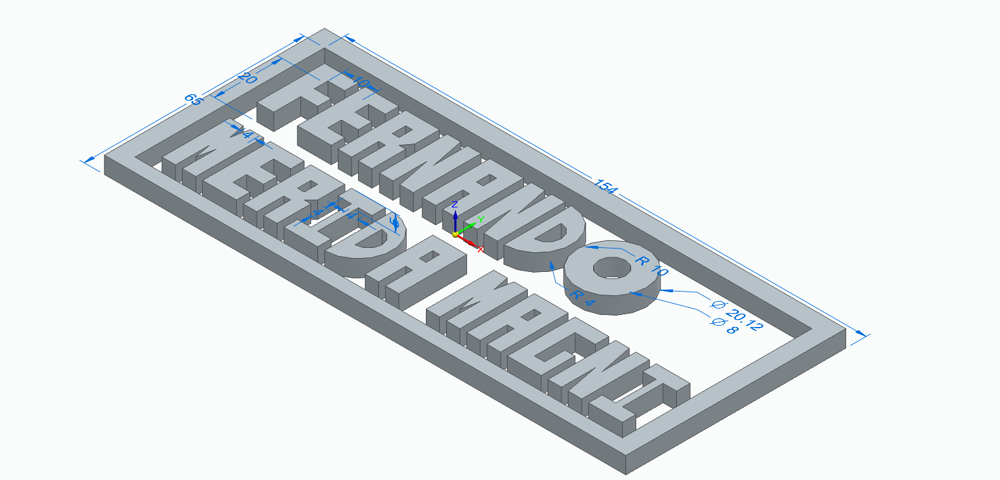

# Practice 4

## Overview

This practice involves a mechanical mechanism design project created using computer-aided design (CAD) software. The design focuses on kinematic analysis and mechanical systems.

## Preview

## Files

- `practice.par` - CAD part file containing the mechanism design

## Objectives

- Apply mechanical design principles
- Create 3D models of mechanical components
- Analyze mechanism kinematics
- Practice CAD software skills

## Software Requirements

- CAD software compatible with `.par` files
- Engineering analysis tools for mechanism simulation

## Usage

1. Open the `practice-11.par` file in your CAD software
2. Review the mechanical design and assembly
3. Analyze the mechanism's motion and behavior
4. Perform any required simulations or calculations

## Teaching Concepts

- Mechanical mechanism design
- Kinematic analysis
- 3D modeling techniques
- Computer-aided engineering
